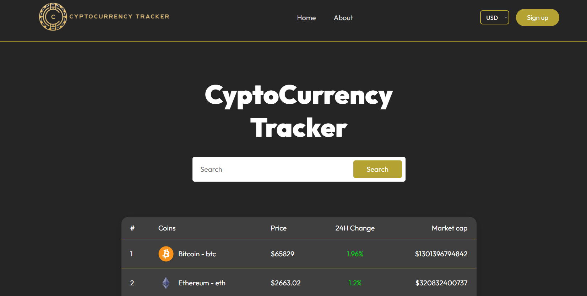

# CryptoTracker

Welcome to **CryptoTracker**, your ultimate companion for navigating the exciting world of cryptocurrencies! This project provides real-time data on cryptocurrency prices, market trends, and comprehensive analytics to help users make informed investment decisions.



## Key Features
- **Real-Time Data:** Track live cryptocurrency prices, market caps, and 24-hour changes.
- **Currency Details:** Click on a currency to view detailed stats, including name, logo, a price chart for the last 10 days, market rank, current price, 24h low/high, and market cap.
- **Multi-Currency Support:** View prices in USD, EUR, and JPY.
- **User-Friendly Interface:** Designed for both beginners and advanced traders with intuitive navigation.
- **About Page:** Learn more about the platform, its goals, and contact info for feedback.

## Tech Stack
- **Frontend:**
  - [React](https://reactjs.org/) with [Vite](https://vitejs.dev/)
  - [React Google Charts](https://react-google-charts.com/) for price charts
  - [Material-UI](https://mui.com/) for UI components
  - [Google Fonts API](https://fonts.google.com/)
- **Backend:**
  - [Node.js](https://nodejs.org/) for running the backend
  - [CoinGecko API](https://www.coingecko.com/en/api) for fetching live cryptocurrency data

## Installation
1. Clone the repo:
   ```bash
   git clone https://github.com/AuroraaSan/CryptoTracker
2. Navigate into the project directory:
   ```bash
    cd CryptoTracker
3. Install dependencies:
   ```bash
    npm install
4. Start the development server:
     ```bash
    npm run dev

## Future Work

### User Accounts and Custom Views
A recommended future enhancement for **CryptoTracker** is implementing user accounts. This feature would allow users to:
- **Save their favorite cryptocurrencies** for quick access.
- **Create and manage custom views** of data tailored to their preferences.
- **Provide a more personalized experience** through user-centered design principles.
